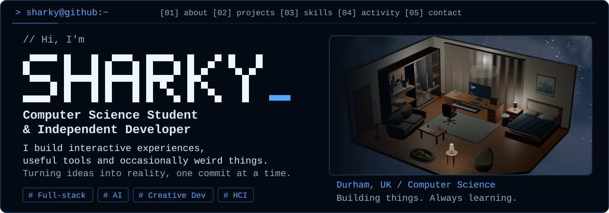
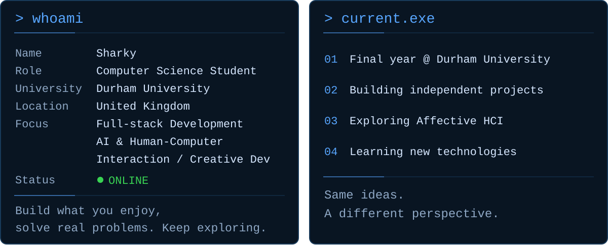
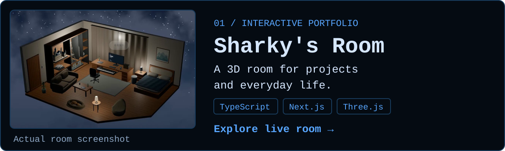
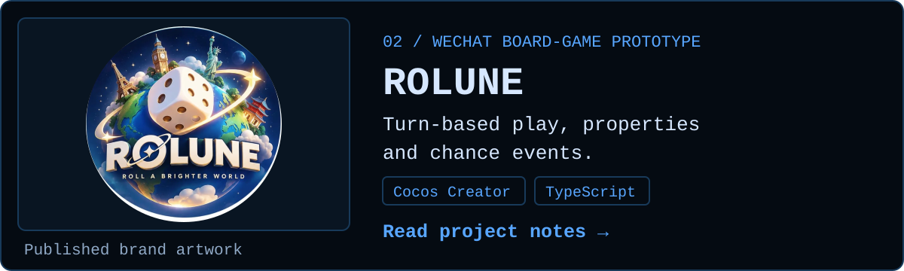
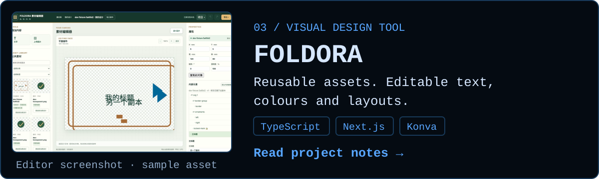
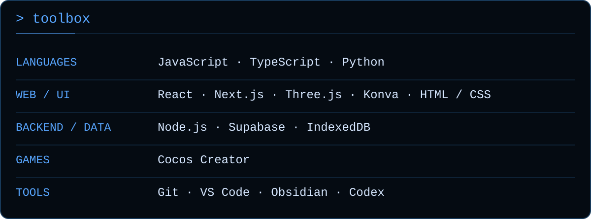
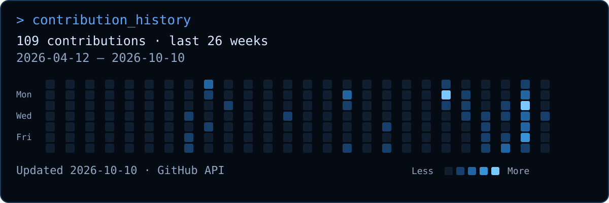
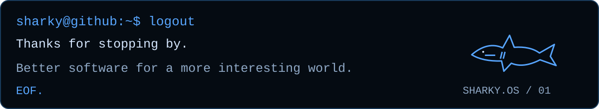

<picture>
  <source media="(max-width: 700px)" srcset="./assets/hero-mobile.svg" />
  
</picture>

  <a href="#about"><code>[01] about</code></a> ·
  <a href="#projects"><code>[02] projects</code></a> ·
  <a href="#skills"><code>[03] skills</code></a> ·
  <a href="#activity"><code>[04] activity</code></a> ·
  <a href="#contact"><code>[05] contact</code></a>

I'm **Sharky (Shaoqi Tang)**, a Computer Science student at **Durham University** and an independent developer. I build interactive experiences, useful tools and occasionally weird things. Turning ideas into reality, one commit at a time.

## `> whoami / current.exe`

<picture>
  <source media="(max-width: 700px)" srcset="./assets/identity-mobile.svg" />
  
</picture>

Profile details · text version

- **Name:** Sharky / Shaoqi Tang
- **Role:** Computer Science Student & Independent Developer
- **University:** Durham University · United Kingdom
- **Focus:** Full-stack Development, AI & Human-Computer Interaction, Creative Projects
- **Currently:** Final year at Durham, building independent projects, exploring Affective HCI and learning new technologies

*Build what you enjoy, solve real problems, and keep exploring.*

## `> selected_work`

<a href="https://sharkytang.com/">
  <picture>
    <source media="(max-width: 700px)" srcset="./assets/project-sharkys-room-mobile.svg" />
    
  </picture>
</a>

**[Sharky's Room →](https://sharkytang.com/)** — An interactive 3D room for sharing my projects and everyday life. 
TypeScript · React · Next.js · Three.js · Supabase

<a href="./docs/PROJECTS.md#rolune">
  <picture>
    <source media="(max-width: 700px)" srcset="./assets/project-rolune-mobile.svg" />
    
  </picture>
</a>

**[ROLUNE →](./docs/PROJECTS.md#rolune)** — A 3D board-game prototype for WeChat, with turn-based play, properties and chance events. 
Cocos Creator · TypeScript · Prototype; source repository is private.

<!-- TODO: Replace ROLUNE brand artwork with a real gameplay screenshot when available. -->

<a href="./docs/PROJECTS.md#foldora">
  <picture>
    <source media="(max-width: 700px)" srcset="./assets/project-foldora-mobile.svg" />
    
  </picture>
</a>

**[FOLDORA →](./docs/PROJECTS.md#foldora)** — A visual editor for reusable design assets: edit text, colours and layouts, then save and export. 
TypeScript · React · Next.js · Konva · Local application; source repository is private.

## `> tech_stack`

<picture>
  <source media="(max-width: 700px)" srcset="./assets/tech-stack-mobile.svg" />
  
</picture>

Tools & technologies · text version

| Area | Technologies |
| --- | --- |
| Languages | JavaScript, TypeScript, Python |
| Web & interfaces | React, Next.js, Three.js, Konva, HTML & CSS |
| Backend & data | Node.js, Supabase, IndexedDB |
| Games | Cocos Creator |
| Tools | Git, VS Code, Obsidian, Codex |

These are tools used across my projects, rather than proficiency scores. See the [content sources](./docs/PROFILE_CONTENT.md).

## `> github_activity`

<a href="https://github.com/SharkyTang?tab=overview">
  <picture>
    <source media="(max-width: 700px)" srcset="./assets/activity-mobile.svg" />
    
  </picture>
</a>

[View live contribution history →](https://github.com/SharkyTang?tab=overview) 
GitHub API snapshot · scheduled daily refresh · date shown on the chart.

*Some days I write code. Some days I debug the code I wrote yesterday.*

## `> connect`

[GitHub](https://github.com/SharkyTang) · [LinkedIn](https://www.linkedin.com/in/shaoqi-tang-058b30306/) · [Portfolio](https://sharkytang.com/) · [Email](mailto:tangshaoqi11@gmail.com?cc=shaoqi_tang@163.com) 
WeChat: `MoYun0617`

<picture>
  <source media="(max-width: 700px)" srcset="./assets/footer-mobile.svg" />
  
</picture>
