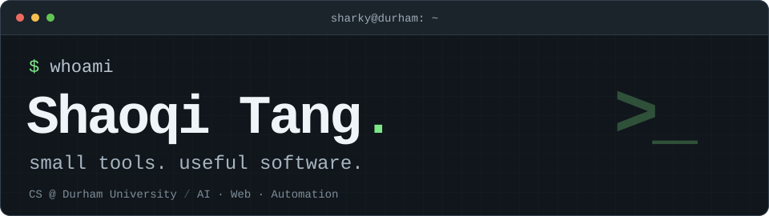

<picture>
  <source media="(max-width: 600px)" srcset="./assets/profile-terminal-mobile.svg" />
  
</picture>

I'm **Shaoqi**, a Computer Science student at **Durham University**. I turn everyday problems into small tools, web apps, and experiments with AI.

### `~/projects`

**word-record-pwa** · Vocabulary & learning  
A progressive web app for recording and reviewing words.

**APCatalog** · Web apps  
A catalog-style project exploring practical app structure.

**explain-obsidian-term-skill** · AI & knowledge tools  
A Codex skill that turns technical explanations into Obsidian notes.

These projects are currently in private repositories.

### `~/toolbox`

`JavaScript` `TypeScript` `Python` `React` `Node.js`  
`HTML & CSS` `Git` `VS Code` `Obsidian` `Codex`

Exploring AI tools, automation, and better developer workflows.

### `~/connect`

[LinkedIn](https://www.linkedin.com/in/shaoqi-tang-058b30306/) · [Email](mailto:tangshaoqi11@gmail.com?cc=shaoqi_tang@163.com) · WeChat: `MoYun0617`

---

`$ build → learn → repeat`
